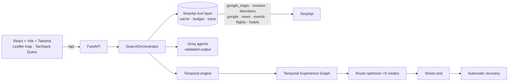

# WAYPOINTS

**Temporal Route Intelligence for real-world travel.**

Traditional itinerary planners optimize *where* you go.
WAYPOINTS optimizes whether the experience will **still work when you actually get there**.

It combines live **[SerpApi](https://serpapi.com)** search with a **Temporal Experience Graph** to discover, validate, stress-test and repair journeys in real time. Reasoning is done by open-source LLMs on **Groq**, only ever over retrieved evidence — never hallucinated.

> *Don't just plan where you're going. Discover what will still be worth experiencing when you get there.*

Built for the **SerpApi India Hackathon 2026 · Track 3: Travel & Local Discovery.**

---

## Implementation status

Everything described in this document is **fully built and running.** This is not a spec.

| Layer | What's built | File(s) |
|---|---|---|
| **SerpApi client** | TTL cache · single-flight dedup · per-journey call budget · key scrubbing · live trace | `serpapi/client.py` |
| **9 SerpApi tools** | `google_maps` · `google_maps_reviews` · `google_maps_directions` · `google` · `google_news` · `google_events` · `google_flights` · `google_hotels` | `serpapi/tools.py` |
| **Demo data** | Full SerpApi-shaped snapshot, same pipeline, no keys needed | `serpapi/demo_data.py` |
| **Discovery pipeline** | 8 real stages, real progress reported to UI | `engine/orchestrator.py` |
| **Temporal fit engine** | Opening hours × arrival time → 7 status codes | `engine/temporal.py` |
| **Waypoint scoring** | 6-component weighted score, 5 route modes | `engine/scoring.py` |
| **Route optimizer** | Beam search over temporal graph | `engine/optimizer.py` |
| **Stress tester** | 6 disruption scenarios, deterministic re-simulation | `engine/stress.py` |
| **Auto-recovery** | Validated replacement search at new arrival time | `engine/repair.py` |
| **Replanning** | Mode · time · add / replace / remove stop | `engine/replan.py` |
| **8 LLM reasoning modules** | Groq (JSON-validated output) → deterministic rule fallbacks | `llm/agents.py` |
| **FastAPI backend** | All endpoints, CORS, SPA fallback, OpenAPI docs | `app/main.py` + `routers/` |
| **React frontend** | 5 pages, 20+ components, Leaflet map, time slider | `frontend/src/` |
| **Test suite** | 7 test files covering the full stack | `backend/tests/` |

The only thing you need to add is your API keys (see below). Everything works without them in demo mode.

---

## What makes it different

| # | Principle | What it means in the product |
|---|-----------|------------------------------|
| 1 | **Temporal City Graph** | A place isn't "good" or "bad". It is scored for *this* journey: arrival time, opening hours, events, golden hour, detour, your interests. |
| 2 | **Route-aware discovery** | Search runs along the real corridor (Gurugram → Manesar → Neemrana → Behror …), not inside the destination. |
| 3 | **Experience windows** | Hours, live events and sunset become windows. A stop only makes the route if you can actually experience it. |
| 4 | **Detour economics** | Every stop shows `+12 min`, `+5 km`, `₹40` — not just "2 km away". |
| 5 | **Plan stress test** | Delay it, close a stop, push an event, skip a stop. The temporal graph is re-run deterministically. |
| 6 | **Automatic recovery** | Broken stops are replaced by alternatives the *backend* has validated at the new arrival time. |
| 7 | **Evidence-first AI** | SerpApi supplies facts; the LLM only reasons over them. Observed / inferred / simulated are never mixed. |

---

## Quick start

**Prerequisites:** Node 18+ · Python 3.11+

```bash
# 1. Clone and enter
git clone <repo-url> waypoints
cd waypoints

# 2. Backend  →  http://localhost:8000
cd backend
pip install -r requirements.txt
cp .env.example .env          # open .env and paste your keys (see below)
uvicorn app.main:app --reload

# 3. Frontend  →  http://localhost:5173  (in a new terminal)
cd ../frontend
npm install
npm run dev
```

Open <http://localhost:5173> and click **Delhi → Jaipur demo** — it runs the full pipeline with **no API keys at all**.

---

## Adding your SerpApi key

> This is the most important step for live search. Everything else is already wired up.

1. Get your key at <https://serpapi.com/manage-api-key>
2. Open `backend/.env`
3. Set `SERPAPI_KEY=<your-key>`
4. Restart the backend (`uvicorn app.main:app --reload`)

That's it. The key never leaves the server — it's scrubbed from every log, error and trace entry. The frontend never sees it.

```env
# backend/.env  — minimum config for live search
SERPAPI_KEY=your_key_here

# Optional: enables LLM reasoning (analyst, curator, narrator)
# Without this, deterministic rule-based fallbacks are used (and labelled as such)
GROQ_API_KEY=your_groq_key_here
```

| Key | Where to get it | What happens without it |
|-----|----------------|------------------------|
| `SERPAPI_KEY` | [serpapi.com/manage-api-key](https://serpapi.com/manage-api-key) | Live search disabled. Demo still works. **Nothing is ever invented.** |
| `GROQ_API_KEY` | [console.groq.com/keys](https://console.groq.com/keys) | Rule-based fallbacks used everywhere. Labelled as such in the UI and trace. |

A typical live journey uses **~40–60 SerpApi calls** (TTL-cached after first run). Set `SERPAPI_MAX_CALLS_PER_JOURNEY=40` in `.env` to protect a small quota.

---

## How SerpApi powers every stage

WAYPOINTS uses SerpApi as its **sole evidence layer**. Every fact that enters the system comes from a SerpApi engine call. Nothing is invented or assumed.

| Stage | SerpApi engines used |
|-------|---------------------|
| Map the route corridor | `google_maps_directions` · `google_maps` (corridor town verification) |
| Find experiences along the way | `google_maps` (category search at each corridor town) |
| Check opening hours | `google_maps` (place details per finalist) |
| Read visitor reviews | `google_maps_reviews` (top reviews for ranking) |
| Find live events | `google_events` · `google_maps` (venue geocoding) |
| Check current signals | `google_news` (closures, disruptions, crowds) |
| Confirm travel times | `google_maps_directions` (per-segment, per finalist) |
| Find evidence for scoring | `google` (web search per experience) |
| Suggest flights | `google_flights` |
| Suggest hotels | `google_hotels` |

Every single call is recorded in the **Live search trace** panel — engine name, query, latency, result count, and whether it was served from cache. You can open this on any route page.

### SerpApi tool layer (`backend/app/serpapi/`)

```python
search_web(query, location, num)             # engine=google
search_maps(query, lat, lon, zoom)           # engine=google_maps
get_place(place_id, data_id, lat, lon)       # engine=google_maps (type=place)
get_reviews(data_id, num, sort_by)           # engine=google_maps_reviews
get_directions(start, end, travel_mode)      # engine=google_maps_directions
search_events(query, location, date_filter)  # engine=google_events
search_news(query)                           # engine=google_news
search_flights(departure_id, arrival_id, outbound_date)  # engine=google_flights
search_hotels(query, check_in, check_out)    # engine=google_hotels
```

All calls go through one client with:
- **Server-side TTL cache** — place hours cached for hours; directions/news/events for minutes
- **Single-flight deduplication** — concurrent identical queries coalesce into one upstream call
- **Per-journey call budget** — configurable cap (`SERPAPI_MAX_CALLS_PER_JOURNEY`)
- **Key scrubbing** — `SERPAPI_KEY` is stripped from every error, log and trace entry
- **3-attempt retry** — 429s and 5xx get exponential backoff; 401/403 fail immediately

---

## Architecture



**The frontend never talks to SerpApi.** All API calls go `frontend → FastAPI → SerpApi`. The key never crosses the wire to the browser.

---

## Discovery pipeline (`engine/orchestrator.py`)

The progress shown in the UI is the **real pipeline executing**, not an animation. Each stage updates the UI as it finishes.

| # | Stage | What runs |
|---|-------|-----------|
| 1 | **Understand** | Journey Analyst (Groq) normalizes travel style, interests, meal needs |
| 2 | **Map the route** | `google_maps_directions` for the full corridor; `google_maps` verifies each town |
| 3 | **Find experiences** | Discovery Planner issues 15–25 `google_maps` searches along the corridor |
| 4 | **Opening windows** | `google_maps` place detail + `google_maps_reviews` for the top 22 finalists |
| 5 | **Events** | `google_events` at corridor towns; venues geocoded through `google_maps` |
| 6 | **Current signals** | `google_news` triaged by Experience Curator; sunset computed from lat/lon/date |
| 7 | **Feasibility** | 5 optimizers over the graph; `google_maps_directions` confirms travel times; `google` adds web evidence |
| 8 | **Stress** | Robustness battery (+15/+30/+45/+60 min delays); fallback validation; narrative |

---

## The eight reasoning modules

| # | Module | Implementation |
|---|--------|----------------|
| 1 | Journey Analyst | Groq (JSON, validated) → rule fallback |
| 2 | Discovery Planner | Groq → rule fallback; queries are generic categories, merged with deterministic corridor coverage |
| 3 | Experience Curator | Groq: preference nudge clamped to ±0.1, review-grounded one-liners (digits rejected), news triage by index |
| 4 | Temporal Validator | `engine/temporal.py` — pure deterministic code |
| 5 | Route Optimizer | `engine/optimizer.py` — beam search, pure code |
| 6 | Stress Tester | `engine/stress.py` simulation; Groq only phrases the narrative result |
| 7 | Recovery Planner | `engine/repair.py` validates replacements; Groq only writes the explanation |
| 8 | Trip Narrator | Groq; every number cited must appear in the evidence, otherwise discarded |

---

## Temporal fit (`engine/temporal.py`)

```
arrival_time + opening_hours + visit_duration (+ event_window + sunset_window)
→ IDEAL_WINDOW | OPEN_AT_ARRIVAL | CLOSING_TOO_SOON | NOT_OPEN
  | EVENT_CONFLICT | WINDOW_MISSED | UNKNOWN_HOURS
```

A restaurant open 6–11 PM at a 7:40 PM arrival scores high. An attraction that closed at 7 PM scores **zero** and is never recommended — no matter how popular it is.

## Waypoint score (`engine/scoring.py`)

```
0.25 × Preference Fit   +  0.20 × Temporal Fit   +  0.20 × Route Fit
0.15 × Experience Quality  +  0.10 × Evidence Reliability  +  0.10 × Current Relevance
```

Weights shift per mode: **Fastest · Experience · Food trail · Scenic · Discovery** — five objective functions over one graph. The UI shows the full score breakdown per stop, not an opaque number.

## Plan robustness

Re-runs the route under +15/+30/+45/+60 min delays. Combines delay survival, buffer minutes, fallback coverage and window flexibility into a single 0–100 score. Explicitly **not** a probability — it's a robustness index.

## Provenance

Every fact in the UI carries one of:
- **Observed** — retrieved directly from SerpApi
- **Inferred** — computed arithmetically from observed data (travel time, detour cost)
- **Simulated** — modelled in a what-if scenario
- **User** — entered by the traveller

The **Live search trace** panel shows every SerpApi call made for the journey: engine, query, latency, result count, and cache status.

---

## Demo mode

`POST /api/journey/discover/start` with `"demo": true` (or the **Delhi → Jaipur demo** button) runs the full pipeline against **deterministic, SerpApi-shaped sample data** — same parsing, scoring, optimizer, stress test and recovery. No keys needed.

The UI always shows a **DEMO SNAPSHOT** badge. Sample venues are labelled "(sample)". It never claims to be live data.

### 3-minute demo script

1. Home → enter Delhi → Jaipur, 8:00 AM, Food + Culture + Photography → **Discover my route**
2. Watch the real 8-stage pipeline run, then see the map with numbered waypoints and detour times
3. Drag the **time slider** — stops fade in/out as opening windows shift
4. Open **View evidence** on any stop: Maps hours, reviews, search result, event
5. **Stress test → +45 min delay** — a stop breaks, a validated replacement appears → **Apply recovery**
6. Click **Search trace** in the top bar to see every SerpApi engine call

---

## API reference

Interactive docs: <http://localhost:8000/docs>

| Method | Path | Purpose |
|--------|------|---------|
| GET | `/api/health` | Status, which keys are configured, demo mode |
| POST | `/api/journey/discover/start` | Start a discovery job (streaming stage progress) |
| GET | `/api/journey/jobs/{id}` | Poll job stage status |
| GET | `/api/journey/{id}` | Fetch a complete journey snapshot |
| GET | `/api/journey/{id}/slice?minute=` | Time slider: every node's fit at a given arrival time |
| POST | `/api/journey/stress-test` | Run one of 6 disruption scenarios |
| POST | `/api/journey/replan` | Change mode · departure time · add/replace/remove stop · apply recovery |
| POST | `/api/journey/segment-discover` | "Show me 5 things along this corridor segment" |
| GET | `/api/place/{id}` | Full place detail |
| GET | `/api/place/{id}/evidence` | All evidence items for a place |
| POST | `/api/search/{maps,web,news,events,directions,flights,hotels}` | Raw SerpApi tool pass-through |

Error format: `{"detail": {"code": "...", "message": "...", "retriable": true/false}}`

When SerpApi is unavailable: `"Live search temporarily unavailable."` with `retriable: true`. Nothing stale or invented is returned.

---

## Repository layout

```
backend/
  app/
    main.py          FastAPI app, CORS, SPA fallback
    config.py        Settings from .env
    schemas.py       All Pydantic models (mirrors frontend types.ts)
    cache.py         TTL cache + single-flight dedup
    trace.py         Per-request search trace context
    store.py         Journey and job persistence (.data/ JSON snapshots)
    serpapi/
      client.py      SerpApi HTTP client (cache · budget · key scrubbing · retry)
      tools.py       9 typed tool functions
      demo_data.py   Deterministic SerpApi-shaped demo responses
    llm/
      groq_client.py Groq async client with retry + streaming
      agents.py      8 reasoning modules (JSON-validated, with rule-based fallbacks)
    engine/
      orchestrator.py  8-stage discovery pipeline with real progress
      graph.py         Temporal Experience Graph data structure
      temporal.py      Temporal fit engine (opening hours × arrival time)
      scoring.py       6-component waypoint scoring, 5 route mode weight sets
      optimizer.py     Beam search route optimizer
      stress.py        6-scenario disruption simulator
      repair.py        Validated replacement search
      replan.py        Replanning (mode · time · add/remove/replace)
      respond.py       JourneyResponse builder
      ingest.py        SerpApi result → ExperienceNode parser
      parsing.py       Hours, budgets, names normalisation
      geo.py           Haversine, corridor projection, axis math
      sun.py           Sunset time from lat/lon/date
      timeutils.py     Clock formatting helpers
    routers/
      journey.py     Discovery, job polling, stress, replan, segment-discover
      search.py      Raw SerpApi tool endpoints
      place.py       Place detail and evidence
  tests/
    conftest.py
    test_temporal.py      Opening hours × arrival time, all 7 status codes
    test_serpapi_client.py Cache, budget, key scrubbing, retry, empty hints
    test_parsing.py       Hours parsing, budget parsing
    test_engine_demo.py   Full demo pipeline, stress, recovery
    test_agents.py        LLM guard rails, fallback activation
    test_live_path.py     Live code path against mocked SerpApi responses
    test_api.py           HTTP API integration tests

frontend/
  src/
    pages/
      HomePage.tsx       Route planner form + hero visualisation
      DiscoverPage.tsx   Live 8-stage pipeline progress view
      RoutePage.tsx      Map + timeline + waypoint cards + time slider
      StressPage.tsx     Disruption simulator + recovery panel
      PlacePage.tsx      Full experience detail + temporal fit chart
    components/
      layout/TopBar.tsx
      home/PlanForm.tsx  HeroViz.tsx
      route/MapView.tsx  TimeSlider.tsx  WaypointCard.tsx  Timeline.tsx
             TraceSheet.tsx  EvidenceSheet.tsx  WhatIfDrawer.tsx
             RobustnessRing.tsx  RouteModes.tsx  SignalsStrip.tsx
             SegmentDiscover.tsx  StayFlights.tsx  ChangeAlert.tsx
             AIInsight.tsx  MapControls.tsx  BottomJourneyStrip.tsx
      ui/button.tsx  chips.tsx  sheet.tsx  logo.tsx  place-art.tsx
    lib/
      api.ts       Typed fetch client
      types.ts     All TypeScript types (mirrors backend schemas.py)
      time.ts      Clock + duration helpers
      utils.ts     cn(), roleLabel(), pct(), etc.
```

---

## Running the tests

```bash
cd backend
python -m pytest
# or with verbose output:
python -m pytest -v
```

No API keys needed — tests use mocked SerpApi responses. The live-path test (`test_live_path.py`) mocks `httpx.AsyncClient` to verify the real HTTP code path without spending quota.

---

## Design decisions

**Why SerpApi and not a scraper?** Reliable structured output, well-defined schemas per engine, rate limits managed by the platform, and support for `google_maps`, `google_events`, `google_flights` and `google_hotels` under one key. Every field we parse is documented.

**Why not a database?** Journeys are self-contained snapshots. A JSON file under `.data/journeys/` holds everything: the request, all SerpApi evidence, the graph, the route, stress results. This makes the demo reproducible and the architecture simple.

**Why Groq?** Open-source models (Llama 3.3 70B), fast inference, JSON mode support, and free tier for experimentation. Every LLM call has a JSON schema and a rule-based fallback — the app never depends on the LLM being available.

**Why Leaflet over Google Maps?** CARTO/OpenStreetMap tiles for rendering, SerpApi Directions for all routing data. This keeps the frontend free of Google Maps billing while still using Google's routing engine through SerpApi.

**Not built on purpose:** accounts, chat UI, gamification, bookings, price predictions, fake ML scores.

---

## Limitations

- Live SerpApi response fields vary by place and locale; parsers are tolerant and show *"Hours unverified"* rather than inventing hours.
- If Directions returns no geometry, the route line is an estimated straight corridor (labelled in the UI footer).
- A typical live journey costs ~40–60 SerpApi credits (cached on repeat runs). Set `SERPAPI_MAX_CALLS_PER_JOURNEY=40` to cap spend.
- The Delhi↔Jaipur corridor has built-in town seeds for runs without Groq; all towns are verified through `google_maps` before use.

---

## License

MIT
