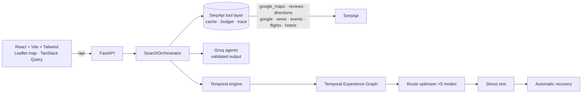

# WAYPOINTS

**Temporal Route Intelligence for real-world travel.**

Traditional itinerary planners optimize *where* you go.
WAYPOINTS optimizes whether the experience will **still work when you actually get there**.

It combines live **SerpApi** search with a **Temporal Experience Graph** to discover, validate, stress-test and repair journeys in real time. Reasoning is done by open-source LLMs on **Groq**, only ever over retrieved evidence.

> *Don't just plan where you're going. Discover what will still be worth experiencing when you get there.*

Built for the SerpApi India Hackathon 2026, Track 3: Travel & Local Discovery.

---

## What makes it different

| # | Principle | What it means in the product |
|---|-----------|------------------------------|
| 1 | **Temporal City Graph** | A place isn't "good" or "bad". It is scored for *this* journey: arrival time, opening hours, events, golden hour, detour, your interests. |
| 2 | **Route-aware discovery** | Search runs along the real corridor (Gurugram → Manesar → Neemrana → Behror …), not inside the destination. |
| 3 | **Experience windows** | Hours, live events and sunset become windows. A stop only makes the route if you can actually experience it. |
| 4 | **Detour economics** | Every stop shows `+12 min`, `+5 km`, `₹40` — not just "2 km away". |
| 5 | **Plan stress test** | Delay it, close a stop, push an event, skip a stop. The temporal graph is re-run deterministically. |
| 6 | **Automatic recovery** | Broken stops are replaced by alternatives the *backend* has validated at the new arrival time. |
| 7 | **Evidence-first AI** | SerpApi supplies facts; the LLM only reasons over them. Observed / inferred / simulated are never mixed. |

---

## Quick start

Prerequisites: Node 18+ and Python 3.11+.

```bash
# 1. backend (http://localhost:8000)
cd backend
pip install -r requirements.txt
cp .env.example .env          # add SERPAPI_KEY and GROQ_API_KEY (both optional for the demo)
uvicorn app.main:app --reload

# 2. frontend (http://localhost:5173) — in a second terminal
cd frontend
npm install
npm run dev
```

Open <http://localhost:5173>. Click **Delhi → Jaipur demo** (or **See how it survives a delay**) — it works with **no API keys at all**.

| Key | Needed for | Without it |
|-----|-----------|------------|
| `SERPAPI_KEY` | Live routes anywhere | Live search is disabled with a clear message. The demo journey still works. Nothing is ever invented. |
| `GROQ_API_KEY` | LLM reasoning (analyst, planner, curator, narrator, explanations) | Deterministic rule-based fallbacks are used and labelled as such in the trace. |

Optional: `npm run build` in `frontend/` and FastAPI will serve the built app on port 8000 too.

### Run the tests

```bash
cd backend && python -m pytest
```

Covers: opening-hours parsing, temporal fit (the spec's 7:40 PM examples, event windows, sunset), the SerpApi client (engine params, cache, key scrubbing, budget), the full demo pipeline, stress tests and recovery validity, replanning, the time slider, the LLM guards, the live code path against a mocked SerpApi, and the HTTP API.

---

## Architecture



**The frontend never talks to SerpApi.** `SERPAPI_KEY` lives only in the backend, is scrubbed from every error and trace, and is never serialized.

### Discovery pipeline (`backend/app/engine/orchestrator.py`)

Progress shown in the UI is the real pipeline, not an animation:

1. **Understand** — Journey Analyst normalizes styles, interests and meal needs
2. **Map the route** — `google_maps_directions`, corridor towns verified through `google_maps`
3. **Find experiences** — Discovery Planner issues corridor searches; dedupe + geographic filter
4. **Opening windows** — `google_maps` place details + `google_maps_reviews` for finalists
5. **Events** — `google_events`, venues geocoded through Maps
6. **Current signals** — `google_news` triaged; sunset computed from lat/lon/date
7. **Feasibility** — five optimizers over the same graph, then travel times confirmed by Directions, then web evidence via `google`
8. **Stress** — robustness battery, fallbacks, narrative

### SerpApi tool layer (`backend/app/serpapi/`)

`search_web` · `search_maps` · `get_place` · `get_reviews` · `get_directions` · `search_events` · `search_news` · `search_flights` · `search_hotels`

All go through one client with server-side TTL cache (places hours, directions/news/events minutes), single-flight de-duplication, a per-journey call budget (`SERPAPI_MAX_CALLS_PER_JOURNEY`) and a trace entry per call.

### The eight reasoning modules

| # | Module | Implementation |
|---|--------|----------------|
| 1 | Journey Analyst | Groq (JSON, validated) → rule fallback |
| 2 | Discovery Planner | Groq → rule fallback; queries are generic categories, merged with deterministic coverage |
| 3 | Experience Curator | Groq: preference nudge clamped to ±0.1, review-grounded one-liners (digits rejected), news triage by index |
| 4 | Temporal Validator | `engine/temporal.py` — pure code |
| 5 | Route Optimizer | `engine/optimizer.py` — beam search, pure code |
| 6 | Stress Tester | `engine/stress.py` simulation; Groq only phrases the result |
| 7 | Recovery Planner | `engine/repair.py` validates; Groq only explains |
| 8 | Trip Narrator | Groq; every number must appear in the evidence, otherwise discarded |

### Temporal fit (`engine/temporal.py`)

`arrival + opening hours + visit duration (+ event / sunset window)` →
`IDEAL_WINDOW · OPEN_AT_ARRIVAL · CLOSING_TOO_SOON · NOT_OPEN · EVENT_CONFLICT · WINDOW_MISSED · UNKNOWN_HOURS`

A restaurant open 6–11 PM at a 7:40 PM arrival scores high; an attraction that closed at 7 PM scores **zero** and is never recommended.

### Waypoint score (`engine/scoring.py`)

```
0.25 Preference Fit + 0.20 Temporal Fit + 0.20 Route Fit
+ 0.15 Experience Quality + 0.10 Evidence Reliability + 0.10 Current Relevance
```

Weights shift per mode (**Fastest · Experience · Food trail · Scenic · Discovery**) — five objective functions over one graph. The UI exposes the reasoning (✓ list + per-component bars), not an opaque score.

### Plan robustness

Re-runs the route under +15/+30/+45/+60 min delays and combines survival, time buffers, fallback coverage and window flexibility. It is explicitly **not** a probability of success.

### Provenance

Every fact carries one of: **observed** (SerpApi) · **inferred** (arithmetic over observed data) · **simulated** (what-if) · **user**. The UI shows these chips everywhere, and the **Live search trace** drawer lists every engine call (engine, query, latency, result count, cached).

---

## Demo mode

`POST /api/journey/discover/start` with `"demo": true` (or the **Delhi → Jaipur demo** button) serves **deterministic, SerpApi-shaped sample data** underneath the *same* pipeline — same parsing, scoring, optimizer, stress test and recovery.

Be aware of what it is: sample data. It mixes real landmarks (approximate coordinates and typical hours) with venues labelled “(sample)” and fictional news/event entries. The UI always shows a **DEMO SNAPSHOT** badge and never claims it is live.

### 3-minute demo script

1. Home → enter Delhi → Jaipur, 8:00 AM, Food + Culture + Photography → **Discover my route**
2. Watch the real stage list, then the map with numbered waypoints and detour times
3. Drag the **time slider**: stops fade, others appear (sunrise walk vs. evening folk music)
4. Open **View evidence** on a stop: Maps hours, reviews, search, event
5. **Stress test → +45 min delay**: a stop breaks, a validated replacement appears, **Apply recovery**
6. Open the **Live search trace** to show the SerpApi engines used

---

## API

Interactive docs: <http://localhost:8000/docs>

| Method | Path | Purpose |
|--------|------|---------|
| POST | `/api/journey/analyze` | Journey Analyst output |
| POST | `/api/journey/discover` | Blocking discovery → `JourneyResponse` |
| POST | `/api/journey/discover/start` | Start discovery job (real per-stage progress) |
| GET | `/api/journey/jobs/{id}` | Poll job stages |
| GET | `/api/journey/{id}` | Fetch a journey |
| GET | `/api/journey/{id}/slice?minute=` | Time slider: every node's fit at that arrival time |
| POST | `/api/journey/stress-test` | `delay · flight_delay · stop_overrun · stop_closed · event_delayed · skip_stop` |
| POST | `/api/journey/replan` | start time, mode, replace/remove/add stop, apply recovery |
| POST | `/api/journey/segment-discover` | “Show me 5 things along this segment” |
| GET | `/api/place/{id}` · `/api/place/{id}/evidence` | Experience details and evidence |
| POST | `/api/search/{maps,web,news,events,directions,flights,hotels}` | Raw SerpApi tools |
| GET | `/api/health` | Status, configured keys |

Errors return `{"detail": {"code", "message", "retriable"}}`. When SerpApi is down: *“Live search temporarily unavailable.”* with a Retry — never stale or invented data.

---

## Repository layout

```
backend/
  app/
    main.py  config.py  schemas.py  cache.py  trace.py  store.py
    serpapi/   client.py  tools.py  demo_data.py
    llm/       groq_client.py  agents.py
    engine/    orchestrator.py  graph.py  temporal.py  scoring.py  optimizer.py
               stress.py  repair.py  replan.py  respond.py  ingest.py  parsing.py  geo.py  sun.py
    routers/   journey.py  search.py  place.py
  tests/
frontend/
  src/
    pages/       HomePage  DiscoverPage  RoutePage  StressPage  PlacePage
    components/  home/  route/  ui/  layout/
    lib/         api.ts  types.ts  time.ts  utils.ts
```

## Design notes

- **Responsive**: map-first on desktop; on phones the map sticks to the top with the time slider beneath, then timeline, cards and stress test.
- **Persistence**: journeys are JSON snapshots under `backend/.data/` (PostgreSQL isn't needed — a journey is a self-contained snapshot of evidence + graph).
- **Maps**: Leaflet with CARTO/OpenStreetMap tiles (rendering only; all travel data comes from SerpApi).
- **Not built, on purpose**: accounts, chat, gamification, bookings, fake ML predictions.

## Limitations

- The live SerpApi path is tested against SerpApi-shaped mock responses; response fields vary by place, so parsers are tolerant and unknown hours are shown as *“Hours unverified”* rather than assumed.
- If Directions returns no geometry, the route line is an estimated straight corridor and is labelled so.
- A typical live journey uses ~40–60 SerpApi calls (cached afterwards); lower `SERPAPI_MAX_CALLS_PER_JOURNEY` to protect a small quota.
- The Delhi↔Jaipur corridor has built-in town seeds for runs without Groq; they are verified through Google Maps before use.

## License

MIT
